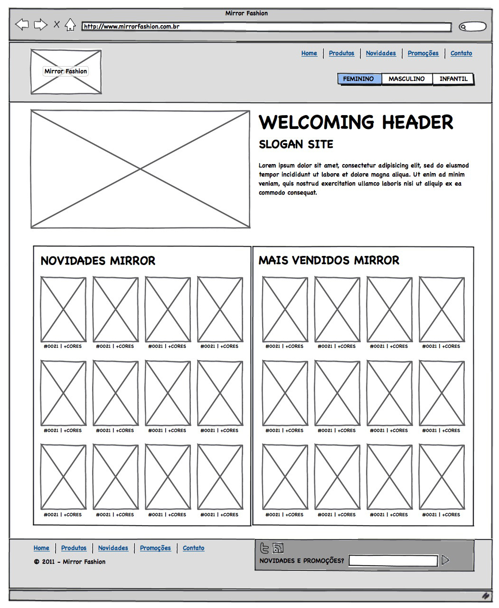
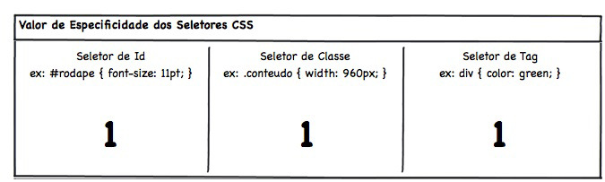
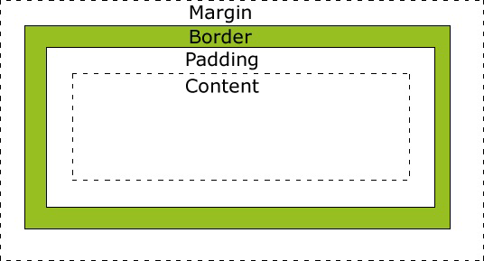

# Desenvolvimento Web com HTML, CSS e JavaScript


# Capítulo 1 — O complexo mundo do *front-end*

### Bibliografias

- **A Arte E A Ciência Do CSS** - Adams & Cols;
- **The Smashing Book** - smashingmagazine

---

# Capítulo 2 — Introdução a HTML e CSS

> O HTML foi desenvolvido para exibição de documentos científicos. Para termos uma comparação, é como se a Web fosse desenvolvida para exibir monografias redigidas e formatadas da Metodologia do Trabalho Científico ABNT. Porém, com o tempo a evolução da Web e de seu potencial comercial, tornou-se necessário a exibição de informações com grande riqueza de elementos gráficos e de interação.

### A instrução DOCTYPE

O **DOCTYPE** não é uma tag HTML, mas uma instrução especial. Ela indica para o navegador **qual versão do HTML** deve ser utilizada para renderizar a página. Utilizamos `<!DOCTYPE html>` , que indica para o navegador a utilização da versão mais recente fo HTML — a versão 5, atualmente.

### TAGS HTML

O HTML 5 introduziu duas novas tags específicas para imagem: `<figure>` e `<figcaption>` . A tag `<figure>` define uma imagem com a conhecida tag `` . Além disso, permite adicionar uma legenda para a imagem por meio da tag `<figcaption>` . 

```html
<figure>
	
	<figcaption>Adidas B2 por R$ 200,20</figcaption>
</figure>
```

### LISTAS EM HTML

Há basicamente três tipos de listas em HTML: listas ordenadas `<ol>` , listas não-ordenadas `<ul>` e listas de definições `<dl>` .

- **Lista ordenadas**

    ```html
    <ol>
    	<li>Primeiro item</li>
    	<li>Segundo item </li>
    	<li>Terceiro item</li>
    </ol>
    ```

- **Lista não-ordenadas**

    ```html
    <ul>
    	<li>Primeiro item</li>
    	<li>Segundo item </li>
    	<li>Terceiro item</li>
    </ul>
    ```

- **Lista de definições**

    ```html
    <dl>
    	<dt>HTML</dt>
    	<dd>
    	    HTML é a linguagem de marcação de textos utilizada
    	    para exibir textos como páginas na Internet.
    	</dd>
    	<dt>Navegador</dt>
    	<dd>
    	   Navegador é um software que requisita um documento
    	   HTML através do portoculo HTTP e exibe seu conteúdo
    	   em uma janela
    	</dd>
    </dl>
    ```

### MARGIN E PADDING

💡Dica: Para centralizar o body podemos usar um truque de colocar um tamanho fixo e margens `auto` na esquerda e na direita. 

Assim:

```css
body{
	margin-left:auto;
	margin-right:auto;
	width:940px;
}
```

---

# Capítulo 3 - HTML semântico e posicionamento no CSS

### O PROCESSO DE DESENVOLVIMENTO DE UMA TELA

> "Um projeto de site ou aplicação web envolve muitas disciplinas em sua execução, pois são diversas características a serem analisadas e diversas as possibilidades apresentadas pela plataforma. Por exemplo, devemos conhecer muito bem as características do público alvo, pois ele define qual a melhor abordagem para definir a navegação, tom linguístico e visual a ser adotado, entre outras. A afinidade do público com a Internet e o computador pode inclusive definir o tipo e a intensidade das inovações que podem ser utilizadas.
**Por isso, a primeira etapa do desenvolvimento do projeto fica a cargo da área de User Experience Design (UX) ou Interaction Design (IxD), normalmente **composta de pessoas com formação na área de comunicação.** Essa equipe, ou pessoa, analisa e endereça uma série de informações da característica humana do projeto, definindo a quantidade, conteúdo e localização de cada informação." *.pg 51*

Veja um esboço de um site, também podemos chamar de **wireframes**



### CSS RESET

Quando não especificamos nenhum estilo para nossos elementos do HTML os navegadores se encarregam de acionar alguns estilos básicos padrão. Esses estilos variam para cada navegador. Sendo assim, um layout pode está conforme especificamos em um navegador, porém ficar quebrado em um outro navegador. Para solucionar esse "problema" podemos setar um valor básico para algumas atributos do CSS. Veja algumas poções para reset os valores do CSS

- HTML5 Boilerplate
- YUI3 CSS Reset
- [Eric Meyer CSS Reset](https://meyerweb.com/eric/tools/css/reset/)

### Block Vs Inline

Basicamente elementos *block* ocupa toda largura da página independente do tamanho do conteúdo. Já elementos *Inline* ocupa apenas o espaço do conteúdo. Para alterar o modo como nossos elementos serão exibidos basta usar a propriedade `display` mudando seu valor para `inline` , `block` ou `inline-block` .

### Position: Static, Relative, Absolute e fixed

> Existe um conjunto de propriedades que podemos utilizar para posicionar um elemento na página, que são *top* , *left* , *bottom* e *right* . Porém essas propriedades, por padrão, não são obedecidas por nenhum elemento, pois elas dependem de uma outra propriedade, a position .

- `static`

    Permanece sempre em seu local original no documento, aquele que o navegador entende como sendo sua posição de renderização. Se passarmos valores para as propriedades de coordenadas, elas não serão respeitadas.

- `relative`

    Um dos valores para propriedade *position* que aceitam coordenadas é o *relative* . Com ele, as coordenadas que passamos são obedecidas em relação à posição original do elemento. Por exemplo:

    ```css
    .logotipo{
    	position: relative;
    	top: 20px;
    	left: 50px;
    }
    ```

- `absolute`

    Existem algumas regras que alteram seu comportamento em determinadas circunstâncias. Por definição, o elemento que tem o modo de posicionamento *absolute* toma como referência qualquer elemento que seja seu pai na estrutura do HTML cujo modo de posicionamento seja diferente de static (que é o padrão), e obedece às coordenadas de acordo com o tamanho total desse elemento pai.
    Quando não há nenhum elemento em toda a hierarquia daquele que recebe o posicionamento *absolute* que seja diferente de *static* , o elento vai aplicar as coordenadas tendo como referência a porção visível da página no navegador. Exemplo:

    ```html
    <div class="quadrado"></div>
    <div class="quadrado absoluto"></div>
    ```

    ```css
    .quadrado{
    	background-color: green;
    	height: 200px;
    	width: 200px;
    }
    .absoluto{
    	position: absolute;
    	top: 20px;
    	right: 20px;
    }
    ```

    No exemplo acima, o segundo elemento `<div>` , que recebe o valor *absolute* em seu atributo , não tem nenhum elemento como seu "Pai" na hierarquia do cocumento, portanto ele vai alinhar-se ao topo e à direita do limite visível da página do navegador. Agora vejamos esse outro exemplo:

    ```html
    <div class = "quadrado relativo">
    	<div class="quadrado absolulto"></div>
    </div> 
    ```

    ```css
    .quadrado{
    	background-color: green;
    	height: 200px;
    	width:200px;
    }
    .absoluto{
    	position: absolute;
    	top: 20px;
    	right: 30px;
    }
    .relativo{
    	position: relative;
    }
    ```

    Nesse caso, o elemento que recebe o posicionamento absoluto é "filho" do elemento  que recebe o posicionamento *relative* na estrutura do documento, portanto, o elemento *absolute* vai usar como ponto de referência suas coordenadas o elemento *relative* e se posicionar 20px ao top e 30px à direita da **posição original** desse elemento.

- `fixed`

    Sempre vai tomar como referência a porção visível do documento no navegador, e mantém essa posição inclusive quando há rolagem na tela. É uma propriedade útil para avisos importantes que devem ser visíveis com certeza.

---

# Capítulo 4 - Mais HTML e CSS

### CLEAR

Existe uma propriedade que determina qual vai ser o comportamento de outros elementos que vêm ao redor daquele que a recebe e estão flutuando, essa propriedade é a `clear` . A propriedade `clear` quer dizer "limpe o fluxo do documento ao meu lado" e pode receber os valores `left` , `right` ou `both` .

O valor `left` impede que elementos flutuantes fiquem à esquerda do elemento que recebe essa
propriedade, o valor `right` impede que elementos flutuem à direita desse, e o valor `both` impede que elementos flutuem em ambos os lados do elemento. É importante sabermos que a propriedade `clear` de um elemento só interfere no layout da página caso outros elementos à sua volta estiverem flutuando.

### INHERIT

Imagine que temos a seguinte divisão com uma imagem:

```html
<div>
	
</div>
```

```css
div {
	border: 2px solid;
	border-color: red;
	width: 30px;
	height: 30px;
}
```

Queremos que a imagem preencha todo o espaçamento da `<div>` , mas as propriedades `width` e `height` não são aplicadas em cascata, sendo assim, somos obrigados a definir o tamanho da imagem manualmente:

```css
img {
	width: 30px;
	height: 30px;
}
```

Esta não é uma solução elegante, porque, se alteramos o tamanho da `<div>` , teremos que lembrar de alterar também o tamanho da imagem. Uma forma de resolver este problema é utilizando o valor `inherit` para as propriedades `width` e `height` da imagem:

```css
img {
	width: inherit;
	height: inherit;
}
```

O valor `inherit` indica para o elemento filho que ele deve utilizar o mesmo valor presente no
elemento pai, sendo assim, toda vez que o tamanho do elemento pai for alterado, automaticamente o elemento filho herdará o novo valor, facilitando assim, a manutenção do código.

### Seletor de atributo do CSS

Além dos seletores de *tag*, *classe* e *id* **** existe uma série de seletores avançados do CSS.

Um dos seletores mais versáteis é o **seletor de atributo**, com ele podemos verificar a presença ou valor de um atributo para secioná-lo. Por exemplo:

```css
input[value]{
	color: #CC0000;
}
```

O seletor acima age em todos os elementos da tag `<input>` que têm o atributo "value". Também é possível verificar se o atributo tem um valor específico:

```css
input[type="text"]{
	border-radius: 4px;
}
```

Além de verificar um valor integralmente, é possível utilizar alguns operadores para selecionar valores em determinadas condições, como por exemplo o seletor de atributo com prefixo:

```css
div[class|="menu"]{
	border-radius: 4px;
}
```

O seletor acima vai agir em todas as tags `<div>` cujo atributo "class" comece com a palavra **menu** seguida de um hífene qualquer outro valor na sequência, como por exemplo **menu-principal, menu-departamentos** e **menu-teste.**

Também é possível buscar uma palavra específica no valor, não importando o valor completo do atributo. Por exemplo:

```css
input[value~="problema"]{
	color: #CC0000;
}
```

O seletor acima agirá sobre todos os elementos da tag `<input>` que contiverem a palavra "problema" em seu conteúdo.

Um fato interessante sobre CSS é que possível utilizar operadores com sinais que  se assemelham aos das **expressões regulares**:

```css
/* busca por inputs com valor de "name" iniciando em "usuario" */
input[name^="usuario"] {
color: #99FFCC;
}
/* busca por inputs com valor de "name" terminando em "teste" */
input[name$="teste"] {
background-color: #CCFF00;
}
/* busca por inputs com valor do atributo "name".
contendo "tela" em qualquer posição */
input[name*="tela"] {
color: #666666;
}
```

# Capítulo 5 - CSS Avançado

### SELETOR DE IRMÃOS

Veja o seguinte HTML, que simula um texto com vários parágrafos, títulos e subtítulos no meio do documento:

```html
<article>
	<h1>Título</h1>
	<p>Início</p>
	<h2>Subtítulo</h2>
	<p>Texto</p>
	<p>Mais texto</p>
</article>
```

Como faremos se quisermos estilizar de uma certa maneira todos os parágrafos após o subtítulo ?

O Seletor **irmãos** (siblings) `~` serve pra isso ! Ele vem do CSS3 e funciona em todos os navegadores modernos.

```css
h2 ~ p{
	font-style: italic;
}
```

Isso indica que queremos selecionar todos os `p` que foram precedidos por algum `h2` e são irmãos do subtítulo (ou seja, estão sob a mesma tag pai). No HTML anterior, serão selecionados os dois últimos parágrafos (Texto e Mais texto).

### SELETOR DE IRMÃO ADJACENTE

Ainda com o HTML anterior o que fazer se quisermos selecionar apenas o parágrafo imediatamente seguinte ao subtítulo ? Ou seja, em um `p` irmão do `h2` mas que aparece logo na sequência.

Simples, fazemos isso:

```css
h2 + p {
	font-variant: small-caps;
}
```

### SELETOR DE FILHO DIRETO

Se tivermos o seguinte HTML com título e seções de um artigo:

```html
<article>
	<h1>Título principal</h1>
	<section>
		<h1>Título da seção</h1>
	</section>
</article>
```

Queremos deixar o título principal de outra cor. Como fazer ? Dessa  forma:

```css
article > h1{
	color:blue;
}
```

### NEGAÇÃO

Imagine o seguinte HTML com vários parágrafos simples:

```html
<p>Texto</p>
<p>Outro texto</p>
<p>Texto especial</p>
<p>Mais texto</p>
```

Queremos fazer todos os parágrafos de cor cinza, exceto o que tem o texto *especial.* Precisamos destacá-lo de alguma forma no HTML para depois selecioná-lo no CSS. Uma classe ou ID resolve:

```html
<p>Texto</p>
<p>Outro texto</p>
<p class="especial">Texto especial</p>
<p>Mais texto</p>
```

Poderíamos usar o **seletor de negação** no CSS dessa forma:

```css
p:not(.especial){
	color: gray;
}
```

Isso diz que queremos todos os parágrafos que não têm a classe especial. A sintaxe do :`not()` recebe como argumento algum outro seletor simples (como classes, IDs ou tags).

### PSEUDO-CLASSES

Imagine o seguinte elemento:

```html
<ul>
	<li>Primeiro item</li>
	<li>Segundo item</li>
	<li>Terceiro item</li>
	<li>Quarto item</li>
</ul>
```

Como selecionar o primeiro e último elemento da `ul` acima, sem usar classes diretamente no HTML? Bem, podemos usar as pseudos classes `first:child` e `last:child` assim :

```css
li:first-child{
	color: blue;
}

li:last-child{
	color: tomato;
}
```

Legal né ? Mas não para por aí veja, pois temos um seletor mais genérico:  `:nth-child()` esse seletor permite que passamos um determinado índice do elemento, veja:

```css
li:nth-child(1){ /* Muda a cor do primeiro elemento*/
	color: tomato;
}
```

Porém, podemos ir além! Pois `:nth-child()` aceita expressões aritiméticas, e isso nos dá um poder incrível como permutar cores de elementos ímpares e pares. Veja:

```css
li:nth-child(2n){ /* seleciona todos os itens pares*/
	background-color: gray;
}

li:nth-child(2n+1){ /* seleciona todos os itens ímpares*/
	background-color: tomato;
}
```

Legal né? Hehe

### PSEUDO-CLASSES DE ESTADOS

```css
a:hover{ /* muda a cor do item quando passamos o mouse sbore*/
	background-color: gold;
}
```

```css
a:link{ /* seleciona todas as âncoras que têm o atributo "href" ,ou seja, links*/
	background-color: blue;
}
```

```css
a:visited{ /* seleciona todos os liknks cujo valor de "href" é um endereço já visitado*/
	background-color: tomato;
}
```

```css
a:active{ /* seleciona todos os liknk no exato momento em que clicamos nele*/
	background-color: tomato;
}
```

### PSEUDO ELEMENTOS

Como selecionar a primeira letra de um parágrafo, sem adicionar nenhuma tag sobre essa letra que precisamos estilizar ? Simples! Podemos utilizar *pseudo elementos.* Veja:

```jsx
<p>Estou lendo a apostila da Caelum!</p>
```

Podemos estilizar dessa forma:

```css
p::first-letter{ /* seleciona a primeira letra dos parágrafos*/
	font-size: 200px;
}

p::first-line{ /* seleciona a primeira linha dos parágrafos*/
	font-style: italic;
}
```

### Novos Conteúdos

Há ainda outro tipo de pseudo-elemento mais poderoso que nos permite gerar conteúdo novo via CSS. Imagine uma lista de itens de uma **`ul`** que queremos, visualmente, colocar entre colchetes:

[ ITEM 1 ]

[ ITEM 2 ]

[ ITEM 3 ]

Podemos, claro, apenas adicionar os colchetes diretamente no HTML. Mas não precisamos que esses colchetes sejam lidos por leitores de tela. Ou seja, será algo apenas VISUAL. Podemos gerá-lo com CSS usando os pseudo lementos **`after`** e **`berore` .**

O HTML seria assim:

```html
<ul>
	<li>ITEM 1</li>
	<li>ITEM 2</li>
	<li>ITEM 3</li>
</ul>
```

E o CSS assim:

```css
li:before{
	content: '[';
}

li:after{
	content: ']';
}
```

Você pode fazer diversos layouts legais com essa técnica, só depende da sua criatividade. 

### CSS3: Progressive enhacement e graceful degradation

A ideia é fazer seu site funcionar em qualquer navegador, sem prejudicar os navegadores mais antigos e sem deixar de usar os novos recursos em navegadores novos. Graceful degradation foi nome da primeira atécnica a pregar isso; o objetivo era montar seu site voltado aos navegadores modernos e fazer com que ele *degradasse graciosamente* , removendo funcionalidades não suportadas.

A abordagem mais recente, chamada **progressive enhancement** tem uma ideia parecida mas ao contrário, comece desenvolvendo as funcionalidades normalmente e vá acrescentando pequenas melhorias mesmo que só funcionem nos navegadores modernos.

Com o CSS 3, podemos usar progressive enhacement. 

Ou seja, faça um layout que fique usável como bordas quadradas mas use bordas redondas para deixá-lo melhor, mais bonito, nos navegadores mais modernos.

### CSS3 TRANSITIONS

Com as transition, conseguimos animar o processo de mudança de algum valor do CSS.

Por exemplo: temos elementos na posição `top:10px` e, quando passamos o mouse em cima (hover), queremos que o elemento vá para `top:30px`  sutilmente. 

```css
#teste{
	position: relative;
	top:10px;
}

#teste:hover{
	top: 30px;
	transition: top 2s;
}
```

Por padrão, a animação é linear, mas temos outros tipos para animação mais suaves:

- `linear` - velocidade constante na animação;
- `ease` - redução gradual na velocidade da animação;
- `ease-in` - aumento gradual na velocidade da animação;
- `ease-in-out` - aumento gradual, depois redução gradual na velocidade da animação;
- `cubic-bezier(x1, y1, x2, y2)` - curva de velocidade para animação customizada

DICA: Para criar curvas de forma interativa [clique aqui](http://www.roblaplaca.com/examples/bezierBuilder/) 

### CSS3 TRANSFORM

Com essa nova especificação, agora é possível alterar propriedades visuais dos elementos antes impossível. Por exemplo, agora podemos alterar o ângulo de um elemento, mostrá-lo em uma escala maior ou menor que seu tamanho padrão ou alterar a posição do elemento sem sofrer interferência de sua estrutura.

### TRANSLATE

- `transforme: translateX (50px);` — move o elemento no eixo horizontal
- `transforme: translateY (-20px);` — move o elemento no eixo vertical
- `transforme: translate (40px, -45px);` — move o elemento nos dois eixos (x,y)

### ROTATE

- `transforme: rotate (-50deg);` — rotaciona o elemento no sentido horário.

### SCALE

- `transforme: scale (1.5);` — altera a escala total do elemento
- `transforme: scale (1, 0.5);` — altera a escala vertical e horizontal do elemento

### SKEW

- `transforme: skewX (10deg);` — distorce o elemento no eixo horizontal vertical

### Especificidade de Seletores CSS

Seletores equivalentes têm suas propriedades sobrescritas conforme são declaradas. Mas o que acontece quando temos diferentes tipos de seletores ? 

Cada tipo de seletor tem um *peso* diferente quando o navegador os interpreta e aplica suas propriedades declaradas aos elementos de um documento. Existe uma maneira bem simples de saber como funciona esses pesos porque eles fazem parte da especificação do CSS. Para ficar um pouco mais fácil é só pensarmos em uma regra simples: **quanto mais específico for o seletor, maior seu valor.** Por isso esse peso, ou valor, que cada seletor tem, recebe o nome de **especificidade.** 

O seletor de tag, por exemplo `div{}` , é bem genérico. As propriedades declaradas nesse seletor serão aplicadas a todos os elementos `div` do nosso documento, não levando em consideração qualquer atributo que eles possam ter. Por esse motivo, o seletor de tag tem valor baixo de especificidade.

Os seletor de classe, por exemplo `.destaque{}` , é um pouco mais específico, nós decidimos quais elementos têm determinado valor para esse atributo nos elementos do HTML, portanto o valor de especificidade do seletor de classe é maior do que o valor de especificidade do seletor de tag.

O seletor id, por exemplo `#cabecalho{}` , é um pouco mais específico, pois só podemos ter um único elemento com determinado valor para atributo id, então seu valor de especificidade é o maior entre os seletores que vimos até agora.

Quando temos seletores combinados podemos calcular sua especificidade baseado na seguinte tabela



Baseado na tabela acima, podemos calcular o valor de especificidade de qualquer seletor CSS, veja:

```css
p{/* valor de especificidade: 001*/
	color: blue;
}

.destaque { /* valor de especificidade: 010 */
color: red;
}

#cabecalho { /* valor de especificidade: 100 */
color: green;
}
```

Já com seletores combinados e compostos , basta somar os valores em suas determinadas posições como nos exemplos a seguir:

```css
#rodape p { /* valor de especificidade: 101 */
font-size: 11px;
}
#cabecalho .conteudo h1 { /* valor de especificidade 111 */
color: green;
}
.conteudo div p span { /* valor de especificidade: 013 */
font-size: 13px;
}
```

Assim, quanto maior o valor de especificidade do seletor, maior a propriedade de seu valor, dessa forma um seletor com valor de especificidade **013** sobrescreve as propriedades conflitantes para o mesmo elemento que um seletor com valor de especificidade **001.**

# Capítulo 6: WEB Para Dispositivos Móveis

### CSS3 Media Queries

Todos os smartphones e navegadores modernos suportam uma nova forma de adaptar o CSS baseado nas propriedades dos dispositivos, as **medias queries** do CSS3.

```css
@media (max-width: 480px){
	body{
		background-color: gold;
	}
}
```

👆🏼 Nesse caso, estamos indicando que telas com largura máxima de 480px tenham um background gold.

### Mobile-First

O mobile-first permite uma abordagem muito mais simples e evolutiva. Inicia-se o desenvolvimento pela área mais simples e limitada, como mais restrições, o mobile. O uso da tela pequena vai nos forçar a criar páginas mais simples, focadas e objetivas. Depois, a adaptação para Desktop com *media queries,* é apenas uma questão de readaptar o layout.

A abordagem desktop-first começa pelo ambiente mais live e vai tentando cortar coisas quando chega no mobile. Esse tipo de adaptação é, na prática, muito mais trabalhosa.

# Capítulo 7: Progressive Enhancement e Mobile-First

Como sabemos, o papel do HTML é proporcionar uma página bem estruturada e a cessível independente do designer. Depois será aplicada outras camadas sobre essa página, podendo ser CSS ou Javascript para deixá-la dinâmica. Esse tipo de pensamento é o **progressive enhancement** novamente. Construir uma base sólida, simples, portável e acessível e, depois, progressivamente, incrementar a página com recurso mais avançados tanto de estilo(CSS) quanto de comportamento com JS.

### Box Model padrão do W3C

Quando alteramos as propriedades de elementos dentro de uma página, precisamos estar cientes de como essas alterações se comportarão na presença de outros elementos. Uma forma de entender o impacto causado pela mudança é pensar no **box model** ou **modelo de caixa** em português.

O **box model** é constituído de quatro áreas retangulares conteúdo (content), espaçamento (padding), bordas (border) e margens (margin) conforme a figura abaixo:



Essas áreas se desenvolvem de dentro para fora, na ordem listada abaixo:

- **conteúdo(content)**: ****aquilo que será exibido;
- **espaçamento(padding):** distância entre a borda e o conteúdo;
- **bordar (border)**: quatro linhas que envolvem a caixa (box);
- **margem (margin)**: distância que separa um box de outro.

### Box-sizing

Por padrão, todos os elementos têm o valor  `box-sizing: content-box;` o que indica que o **tamanho dele é definido pelo seu conteúdo apenas**, ou seja, é o tal box model padrão que vimos antes. Mas podemos trocar por `box-sizing: border-box;` que indica que **o tamanho agora levará em conta até a bordar,** ou seja, **o `width` será a soma do conteúdo com a bordar e o padding**.

## Tabelas

O uso de tabelas era muito comum há alguns anos para a definição de áreas. Seu uso para essa finalidade acabou se tornando prejudicial pela complexidade da marcação, o que dificulta bastante a manutenção das páginas. Além disso havia uma implicação direta na definição de relevância do conteúdo das tabelas para os indexadores de conteúdo por mecanismos de busca. Porém, as tabelas são bastante usadas quando precisamos agrupar alguns dados.  Veja como usá-las :

```html
<table>
	<th>
		<th> Título da primeira coluna<th/>
		<th> Título da segunda coluna<th/>
	</th>
	<tr>
		<td>Linha1, coluna1</td>
		<td>Linha1, coluna2</td>
	</tr>
	<tr>
		<td>Linha2, coluna1</td>
		<td>Linha2, coluna2</td>
	</tr>
</table>
```

Note que na primeira linha `<th>` da tabela, as células são indicadas com a tag `<th>` , o que é útil para diferenciar seu conteúdo das células de dados.

Existe diversas maneiras de se alterar uma estrutura de uma tabela, como por exemplo indicamos que uma célula `<td>` ou `<th>` ocupa mais de uma linha de altura por meio do atributo `rowspan` , ou então que ela ocupa mais de uma coluna de largura com o uso do atributo `colspan` . 
Podemos adicionar um título à nossa tabela com a tag `<caption>` .
Também podemos usar as tags `<thead>` , `<tfoot>` e `<tbody>` , que serve para agrupar linhas de nossa tabela. 

Outra tag de agrupamento que temos na tabela é a que permite que sejam definidas as colunas, é a tag `<colgroup>` . Dentro dessa tag definimos uma tag `<col>` para cada coluna, e dessa maneira podemos adicionar alguns atributos que influenciarão todas as células daquela coluna.

# CAPÍTULO 8 - BOOTSTRAP E FORMULÁRIOS HTML

Uma tendencia em alta no mundo front-end é o uso de Frameworks CSS com estilos bases que servem para agilizar o nosso trabalho. Uma Framework CSS possibilita um estilo base para uma página WEB, sem precisarmos criar tudo na munheca. 

Um Framework bastante utilizada é o **Twitter** **Bootstrap.** Como o seu nome sugere, ela foi criada pelo pessoal do Twitter para uso interno da empresa, porém, em seguida seu código conte foi aberto e o projeto ganhou tantos adeptos que passou a ser chamado apenas de **Bootstrap**. Veja algumas vantagens dessa Framwork:

- Reset CSS
- Estilo visual base pra maioria das tags
- Ícones
- Grids prontos para uso
- Componentes CSS
- Plugins JavaScript
- Tudo responsivo e mobile-first

### Formulários a Fundo

Para usarmos formulários em HTML precisamos usar a tag `<form>`  e, além disso, alguns métodos importantes. Veja:

```html
<form action="/efetivar.html" method="POST">
	<label for="nome">Nome: </label>
	<input type="text" name="nome" id="nome">
	<input type="submit">
</form>
```

O formulário exemplificado anteriormente apresenta o atributo obrigatório **`action`** . O valor desse atributo é o endereço para onde as informações do formulário serão enviados, e sse valor depende inteiramente de como é feita a aplicação que receberá essas informações no lado do servidor.

O segundo atributo, `method` , especifica o método do HTTP pelo qual essa informação será transmitida. O valor `POST` , de maneira simplista, significa que queremos inserir as informaçẽs desse formulário, salvá-la de alguma maneira. Outro valor possível para esse atributo, o `GET` , é utilizado quando queremos obter alguma coisa a partir das informações que estamos transmitindo, por exemplo, um formulário de busca. ****

### Label

Adicionamos a marcação do elemento `<label>` . Esse elemento é uma tag de conteúdo, e seu texto é exibido de maneira comum dentro do nosso formulário, a única diferença é que essa marcação faz uma ligação com outro elemento qualquer em nosso formulário. [Note que nosso `label` tem o atributo `for` , que recebe `nome`](https://www.notion.so/kaell/Desenvolvimento-Web-com-HTML-CSS-e-JavaScript-2b60d3609c2749fe8eea58a20f21fdfa#e85ae6ef58a043bf82007fb1ef715580) .

Assim, quando clicamos sobre o elemento label seremos levado até o atributo `input` , o qual possui o `id` igual o atributo `for` do `label`.

Justamente por causa desse *link* essa marcação `label` é de extrema importância para a usabilidade e acessibilidade dos nossos formulários.

### Input

A tag `input` é muito usada nos formulários. Com essa tag podemos capturar diversos tipos de dados como *data, hora, número, nome*  e muito mais. Para isso usamos o atributo `type` para especificar qual o tipo de dados estamos interessados.

### Textarea

Quando desejamos que o suário insira uma quantidade grande de informações textuais, incluindo quebras de linhas, é necessário o uso de tag **textarea**

```html
<textarea name="texto"></textarea>
```

### Select, Optgroup e option

Quando desejamos que o suário selecione entre diversas opções, com a possibilidade de flexibilizar a maneira com que ele interage com o componente do formulário, podemos utilizar a tag `<select>` .

```html
<select name="cidade">
	<option value="bsb">Brasília</option>
	<option value="rj">Rio de Janeiro</option>
	<option value="sp">São Paulo</option>
</select>
```

Além disso, podemos agrupar as informações também:

```html
<select name="bairro">
  <optgroup label="Brasília">
	  <option value="asan_bsb">Asa Norte</option>
	  <option value="asas_bsb">Asa Sul</option>
  </optgroup>
  <optgroup label="Rio de Janeiro">
	  <option value="botafogo_rj">Botafogo</option>
	  <option value="centro_rj">Centro</option>
  </optgroup>
  <optgroup label="São Paulo">
	  <option value="vlmariana_sp">Vila Mariana</option>
	  <option value="centro_sp">Centro</option>
  </optgroup>
</select>
```

### Novos componentes do HTML5

O HTML5 vem trazendo novos recursos que facilitam a coleta de informações no navegador. Veja a lista abaixo:

- email

    ```html
    <input type="email" name="email">
    ```

- number

    ```html
    <input type="number" max="100" step="5">
    ```

- url

    ```html
    <input type="url" name="endereco">
    ```

- range

    ```html
    <input type="range" name="volume">
    ```

- date, month, week, time, datetime e datetime-local

    ```html
    <input type="date" name="validade">
    ```

- cor

    ```html
    <input type="color" name="cor_olhos">
    ```

- search

    ```html
    <input type="search" results="10">
    ```

- tel

    ```html
    <input type="tel" results="telefone">
    ```

### Novos atributos HTML5 em elementos de formulários

- **autofocus**

    Presença indica que aquele campo deve iniciar com foco quando a página for carregada.

- **placeholder**

    Exibe o texto contido em seu valor dentro do elemento do formulário caso o seu valor seja vazio.

- **autocomplete, list e datalist**

    Exibe uma lista de sugestões ao usuário.

    ```html
    <input type="text" list="ciades" autocomlete="on">
    <datalist id="cidades">
    	<option value="Brasília">
    	<option value="São Paulo">
    	<option value="Aracaju">
    </datalist>
    ```

     

    ### Validação HTML5

    Entre muitas novidades de formulários que vimos no HTML5, há ainda toda uma parte de validação de dados com restrições expressas diretamente no código HTML.

    - **`required`** Podemos indicar na marcação do formulário quando um campo é de preenchimento obrigatório.

        ```html
        <input type="text" name="nome" required>
        <!--Permite uma validação fraca-->
        ```

    - `**pattern`** Também podemos usar expressões regulares

        ```html
        <input type="text" name="nome" pattern = "^\w{2,}">
        ```

# Capítulo 9 - JavaScript e Interatividade na WEB

No início da internet as páginas WEB não eram nada interativas, ou seja, essas páginas eram basicamente documentos que apresentavam seus conteúdos exatamente como foram criados. Então, basicamente a Internet se resumia em navegar através de *links* e enviar informações através de formulários isso era basicamente tudo o que se poderia fazer.

### Nasce o JavaScript

Visando o potencial da *internet* para o publico, somado a necessidade de haver maior interação do usuário som as páginas WEB, a Netscape, criadora do navegador mais famoso do início dos anos 90, de mesmo nome da empresa, criou o **LiveScript.** Uma linguagem simples, que permite a execução de escripts contidos nas páginas dentro do próprio navegador. 

Aproveitando o sucesso do Java na época, que era outra linguagem  de programação  criada pela *Sun,* a *Netscape* em parceria com a *Sun* resolveu batizar a **LiveScript** de **JavaScript.** 

Sendo assim, a linguagem **JavaScript** foi um sucesso e considerada a linguagem de programação mais popular no mundo de desenvolvimento WEB. Ela é suportada por todos os navegadores do mercado, e responsável por qualquer tipo de dinamismo em uma página WEB.

### Características da Linguagem

- Linguagem Interpretada
- Uma linguagem de scripting - *Uma linguagem de scripting é comumente definida como uma linguagem de programação que permite ao programador controlar uma ou mais aplicações de terceiros.*
- Grande tolerância a erros

### DOM: Sua página no Mundo JavaScript

Para permitir alterações na página, ao carregar o HTML da página, os navegadores carregam na memória uma estrutura de dados que representa cada uma das nossas tags no JavaScript. Essa estrutura é chamada de **DOM** (***D**ocument **O**bject **M**odel)* . Essa estrutura pode ser acessada através da variável global **document.**

- **querySelector**

    Antes de sair alterando nossa página, precisamos indicar ao JavaScript qual elemento devemos alterar. Como por exemplo alterar um título da página:

    ```jsx
    document.querySelector("h1")
    ```

    👆🏻Esse comando usa os **seletores CSS** para encontrar os elementos na página. usamos um seletor de nome de tag, mas poderíamos ter usado outros como seletores de **classes** e **id.**

    ```jsx
    document.querySelector(".class")
    document.querySelector("#id")
    ```

- **querySelectorAll**

    As vezes precisa selecionar vários elementos de uma página, por exemplo selecionar todos os elementos que contém a classe .*cartão.* Para isso basta utilizar **querySelectorAll** que será retornado um *array* de todos os elementos.

    ```jsx
    document.querySelectorAll(".cartão")
    ```

    ### Alguns dos eventos em JavaScript

    - oninput → quando um elemento input tem seu valor modificado
    - onclick → quando ocorre um click com o mouse
    - ondbclick → quando ocorre dois clicks como mouse
    - onmousemove → quando mexe o mouse
    - onmousedown → quando aperta o botão do mouse
    - onmouseup → quando solta o botão do mouse (útil com os dois acima para gerenciar drag'n'drop — famoso arrasta e solta)
    - onkeypress → quando pressionar e soltar uma tecla
    - onkeydown → quando pressionar uma tecla
    - onkeyup → quando soltar uma tecla
    - onblur → quando um elemento perde o foco
    - onfocus → quando um elemento ganha foco
    - onchange → quando um input, select ou textarea tem seu valor alterado
    - onload → quando a página é carregada
    - onunload → quando a página é fechada
    - onsubmit → disparado antes de submeter o formulário (*útil para realizar validações* )

    ### Alguns dos eventos em JavaScript

    Em JavaScript, podemos criar um *timer* para executar um trecho de código após um certo tempo, ou ainda executar algo de tempos em tempos.

    A função `setTimeout` permite que agendemos alguma função para execução no futuro e recebe o nome da função a ser executada e o número de milissegundos a esperar:

    ```jsx
    // Executa minha função daqui um segundo
    setTimeout(minhaFuncao, 1000)
    ```

    Se for um código recorrente, podemos usar o setInterval que recebe os mesmo argumentos mas executa a função indefinidamente de tempos em tempos.

    ```jsx
    // executa a minha Função de um em um segundo
    setInterval(minhaFuncao, 1000)
    ```

    ### Vários Callbacks no Mesmo Elemento

    Uma maneira prática e a mais utilizada para adicionar um  evento a um elemento é a seguinte:

    ```jsx
    document.querySelector('#destaque).addEventListener('click', function(){
    	// tratamento do evento aqui
    })
    ```

    Porém, a solução anterior não funciona em algumas versões do IE. E seria escrita de outra forma, mas para evitar ficar escrevendo códigos diferentes para atender a mesma funcionalidade podemos utilizar uma framworks JavaScript, como o **jQuery** por exemplo. 

    # JQuery

    JQuery é uma biblioteca JavaScript com diversas funcionalidades voltadas à solução dos problemas mais difíceis de serem contornados com o uso do JavaScript puro.

    A principal vantagem de usar uma biblioteca de JavaScript é permitir uma maior compatibilidade de um mesmo código com diversos navegadores.

    ### A função `$`

    O jQuery é uma grande biblioteca que contém diversas funções que facilitam a vida do desenvolvedor. A mais importantes delas, que inicia a maioria dos códigos, é a função `$` .

    Com essa função podemos selecionar um elemento de forma mais eficiente, e com maior compatibilidade com outros browser, veja duas formas de escrever o mesmo código. A primeira é com JavaScript puro, a segunda, com Jquery. 

    ```jsx
    // JS PURO
    var cabecalho = document.querySelector('#cabecalho')

    if(cabecalho.attachEvent){
    	cabecalho.attachEvent('onclick', function(event){
    		alert('Você clicou no cabeçalho, usuário do IE!')
    	})
    }else if(cabecalho.addEventLister){
    	cabecalho.addEventListener('click', function(event){
    		alert('voce clicou no cabeçalho')
    	}, false)
    }

    // com jQuery
    $('#cabecalho').click(function(event){
    	alert('você clicou no cabeçalho')
    })
    ```

    Mais sobre a função `$`

    ```jsx
    $('#cabecalho').css({'margin-top':'20px','color':'#333333'})
    .addClass('selecionado')
    ```

    No código acima, chamamos a função `$` e passamos como argumento um seletor de `id`, em seguida chamamos a função `css` a qual recebe um objeto como argumento, essa função `css` irá aplicar todos esses atributos ao elemento `#cabecalho` a qual selecionamos com a função `$` . Note também que adicionaremos uma classe *'selecionado'* com a função `addClass` .

    ### jQuery seletores

    - `$('tbody td').hide();` → Esconde todas tags *td* filhas de *tbody*
    - `$('#form').css('background','black');` → Deixa o *background* de form preto.
    - `$('.headline').hide();` → esconde todos os elementos com o atributo *class* igual a *.headline*
    - `$('p').text('Hello!')` → muda o texto de todos os parágrafos
    - `$('div > p:first')` →o primeiro elemento `<p>` imediatamente filho de uma `<div>`
    - `$('input:hidden')` →todos os inputs invisíveis
    - `$('input:selected')` → todas os checkboxes selecionados
    - `$('input[type=button]')` → todos os inputs com type='button'
    - `$('td, th')` → todas tds e ths

    ```jsx
    // forma ineficiente
    alert($('div').text() + $('p').text() + $('ul li').text());

    // forma eficiente
    alert($('div, p, ul li').text());
    ```

    ### Filtros Customizados e por DOM

    - `$('div > p');`  → *<p>s* imediatamente filhos de *<div>*
    - `$('p + p');` → *<p>s* imediatamente precedidos por outro *<p>*
    - `$('div:first-child');` → um elemento `<div>` que seja o primeiro filho
    - `$('div:last-child');` → um elemento `<div>` que seja o último filho
    - `$('div > *:first-child');` → um elemento que seja o primeiro filho direto de uma `<div>`
    - `$('div > *:last-child')` → um elemento que seja o último filho direto de uma `<div>`
    - `$('div p:nth(0)');` →o primeiro elemento `<p>` filho de uma `<div>`
    - `$('div:empty');` → `<div>`s vazias

    ### Utilitário de iteração com jQuery

    O jQuery traz consigo uma função que facilita a iteração em elementos de um *array* com uma sintaxe mais agradável. Veja:

    ```jsx
    // usando com elementos 1
    $('#menu-departamentos li').each(function(index, item){
    	alert(item.text())
    })

    //usando com qualquer array 2
    var pessoas = ["João", "José", "Maria", "Antônio"];
    $.each(pessoas, function(index, item) {
    	alert(item);
    })
    ```

    A primeira função `each` é chamada  após os seletor, irá executar a função que passamos como parâmetro para cada elemento encontrado. 

    ### Plugins jQuery

    A grande riqueza do jQuery é sua vasta gama de plugins disponíveis para diversos objetivos para saber mais sobre esses plugins [acesse o diretório oficial.](http://plugins.jquery.com/)

    Cada plugin é um código JavaScript que você incorpora na sua página para uma funcionalidade específica.

    # CAPÍTULO 11 - INTEGRAÇÕES COM SERVIÇOS WEB

    ### WEB 2.0 Integrações

    O poder da WEB consistem em interligar várias páginas por meio de diversos links. Basicamente a WEB nasceu com esse propósito. Porém, a WEB 2.0 trouxe novos conceitos mais complexos. Por exemplo como interligar páginas e serviços diferentes criando novos resultados a partir de outras páginas. 

    ### Iframes

    Uma das formas de se fazer esse tipo de integração é com a tag `<iframe>` . Essa tag permite embutir o conteúdo de uma outra página no meio da nossa de forma bem prática.

    ```html
    <iframe src='paginaqualquer.html'></iframe>
    ```

    Por exemplo poderíamos reservar uma área em nossa página para essa tag, e adicionar uma mapa de qualquer outro serviço.

    ### Vídeo embutido com Youtube

    O site do Youtube permite uma integração muito fácil com nossas páginas WEB, basicamente será gerado uma tag `<iframe>` a qual podemos adicionar em nossa página.

    ### Fontes Customizadas com o *@font-face*

    Ao declarar um estilo de fonte em um determinado site é preciso que o computador solicitante  da página tenha essa fonte instalada para aplicá-las, caso não tenha, o navegador irá implementar a fonte padrão. Evitando a quebra de estilo de nossos sites o CSS possibilita um recurso chamado `@font-face` com esse recurso podemos especificar onde o navegador poderá baixar nossas fontes. Podemos incorporar nossas fontes na pasta de nosso projeto ou podemos baixá-las em tempo de requisição em serviços de *WEB FONTS*. Esta última opção é a mais viável por motivos de compatibilidade entre navegadores. Aqui estão alguns dos serviços WEB Fonts mais utilizados no mercado:

    - [Adobe Fonts](https://fonts.adobe.com/) **PAGO**
    - [Google Fonts](https://fonts.google.com/) **FREE**

# Capítulo 12 - OTIMIZAÇÕES DE FRONT-END

Diversos estudos feito por empresas renomadas mostram que um sites rápidos, além de serem prazerosos no quesito usabilidade, também possibilita ganhos monetários significativos para empresa.

A **Amazon**, por exemplo, descobriu que cada 100ms de melhora no carregamento do seu site possibilitava um aumento de 1% no seu faturamento.

O **Yahoo**! provou que cada 400ms de melhora em sua page provocava um aumento de 90% no tráfego de usuários.

A **Monzilla** tornou suas páginas 2.2s mais rápidas e, com isso, causou um aumento de 15% nos downloads do Firefox.

A **Google** descobriu que aumentar o tempo de carregamento da página de busca de 0.4s  para 0.9s ao subir o número de resultados de 10 para 30 diminuía o tráfego em 20%

Dessa forma, fica evidente a importância de criar uma página bem otimizada e fluída.

### World Wide WEB

A primeira coisa que devemos levar em consideração entre o ciclo de cominicação cliente(navegador) e servidor é que o cliente precisa saber onde está localizada página(recurso), ou seja, qual o link que deve ser acessado para obter determidao recurso. Por isso esse endereço é conhecido como **url (***Universal Resource Locator)*

`http`://`209.85.227.121`:`80`/`index.html`

Essa *URL* é composta de quatro partes:

- `http` →  É o protocolo de comunicação utilizado para obtenção de recursos(páginas).
- `209.85.227.121` →  Endereço de **IP**  do servidor(onde está hospedado o recurso que necessitamos)
- `80` →  Porta de comunicação. Os servidores WEB utilizam a porta 80 por padrão, ou seja, não precisamos passar para URL assim como o `http` ela pode ser omitida.
- `index.html` → Caminho do recurso que desejamos obter dentro do sevidor.

# Capítulo 13 — LESS

LESS é uma linguegem baseada em CSS com recursos que fazem falta no CSS em algumas situações. É chamado de pré-processador porque ele gera o arquivo CSS no final. Um dos recursos interessantes do LESS é o uso de variáveis em estilos. Veja:

```css
@corprincipal: #BADA55

#titulo{
	font-sixe: 2em;
	color: @corprincipal;
}

.button{
	background-color: @corprincipal;
	color: white;
}
```

Note que podemos utilzar uma variável para armazenar uma determinada cor e em seguida apenas utilizar seu nome quando for aplicar essa cor. O a exepressão `@corprincipal` não é CSS puro, mas tem uma sintaxe bem parecida e familiar.

### Contas

Suponha que precisamos de um elemento com tamanho de *960px,* porém dentro desse elemento queremos duas colunas e um padding de 35px e dexando *20px*  entre essas colunas. Ou seja, seria necessário duas colunas de *435px.*

Esse problema pode ser resolvido da seguinte maneira:

```css
.container{
	padding: 35px;
	width: 960px;
}
.coluna{
	width: 435;
}
```

Porém note que se alguém alterar o tamanho do *padding* será necessário realizar a conta novamente *(960px - padding * 2 - 20px)/2.* Com o LESS, você pode fazer a conta direto na propriedade e o resultado final é calculado **

```css
.coluna{
	width: (960px - 35px * 2 - 20px)/2;
}
```

Nesse exemplo poderíamo utlizar variáveis para maior reuso do código:

```css
@total: 960px ;
@respiro: 35px;
@espacamento: 20px;
.container{
	padding: @respiro;
	width: @total;
}

.coluna{
	width: (@total - @respiro * 2 - @espacamento)/2;
}
```

### Hierarquia

Com o LESS também podemos aplicar um nível de hierarquia ao nossos elementos note o primeiro código e o segundo *.*

```css
/*Código 1 sem usar o LESS*)**/
#topo{
	widhth: 100%;
}
# topo h1{
	font-size: 2em;
}
#topo ul{
	margin-left: 10px;
}
```

```css
/*Código 2 usando LESS*)* */
#topo{
	widhth: 100%;

	h1{
		font-size: 2em;
	}

	ul{
		margin-left: 10px;
	}
}
```

Note como a segunda opção é menos verbosa!

---

Todo esse material foi baseado na apostila da [Caelum Desenvolvimento WEB](https://www.caelum.com.br/apostilas)